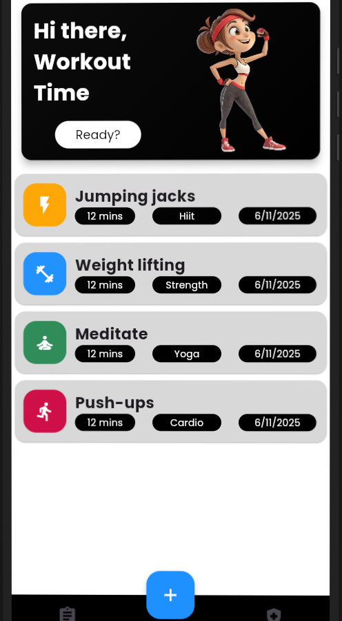
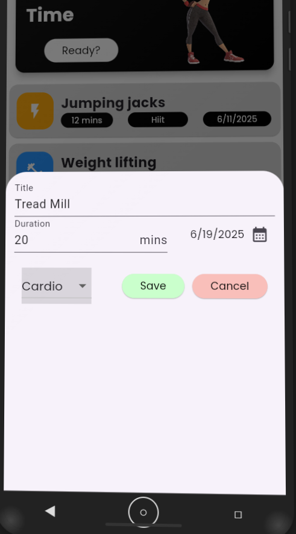
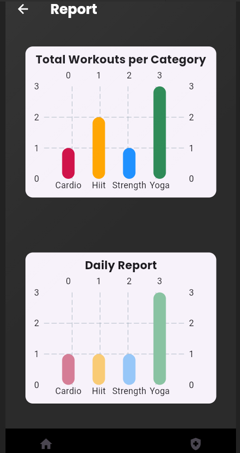
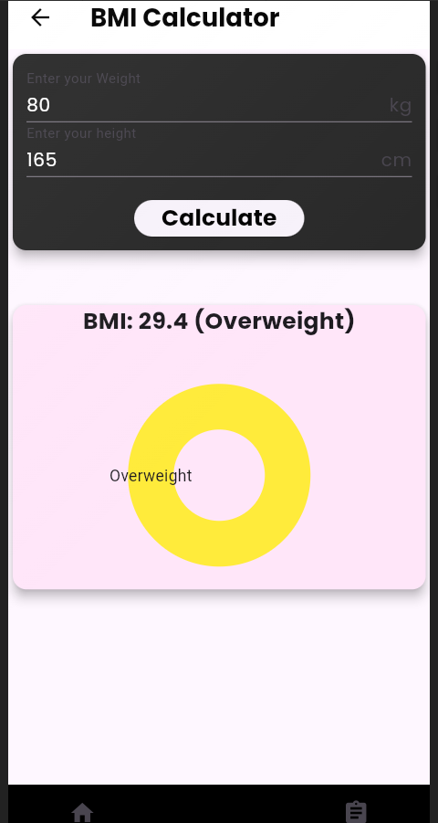
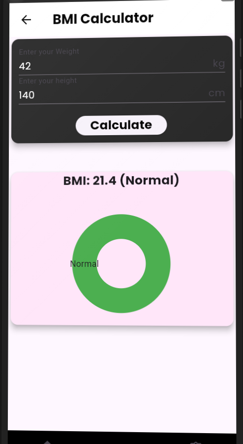

# 🏋️‍♀️ Fitness Tracker App

A simple and elegant Flutter application to track your daily workouts, view statistics, and maintain a healthy lifestyle.

## 📱 Project Description

The Fitness Tracker App helps users log their workouts by entering:

1) Title

2) Duration (in minutes)

3) Category (Cardio, Strength, Yoga, Hiit)

4) Date

The app stores this data locally  and visualizes it with bar charts. It offers an intuitive UI for tracking fitness progress over time.

## ✨ Features

📝 Add Workout Logs — Input title, category, duration, and date.

📊 View Reports — Bar charts for:

- Total workouts by category

- Workouts scheduled for today

🗂️ Workout History — List of workouts with date, category, and duration.

❌ Swipe to Delete — Remove logs using Dismissible cards.

🔁 Data Persistence — Data is saved locally using SharedPreferences.

## 📦 Tech Stack

Flutter for UI

Dart as the programming language

FL Chart for bar chart visualizations

SharedPreferences for local storage

Google Fonts for clean typography

## 🧪 To Run the Project

1. Clone the repo:
```bash
git clone https://github.com/AbhyaAhuja/fitness_tracker_app.git
```
2. Navigate to the project directory and get dependencies:
   ```bash
   cd fitness_tracker_app
   flutter pub get
   flutter run
   ```


## 📁 Folder Structure


<pre> ```text 
>>>>>>> ecbb48a (updated README again)
lib/
├── main.dart                 # Entry point of the app
├── model/
│   └── Workout.dart          # Workout model with enum & utility methods
├── screens/
│   ├── HomePage.dart         # Main screen with workout list
│   ├── ReportPage.dart       # Visual report screen with charts
│   └── BMIPage.dart          # BMI screen
├── widgets/
│   ├── WorkoutCard.dart      # UI component for displaying workout logs
│   ├── DailyBarChart.dart    # Daily chart visualization
│   └── SBarChart.dart        # Summary chart visualization
│   └── AddLogs.dart          # Add new logs
``` </pre>


## Screenshots:


### 🏠 Home Page




### ➕ Add Workout




### 📊 Report Page




### 📐 BMI Calculator







#### 👨‍💻 Author
Built with ❤️ by Abhya Ahuja

